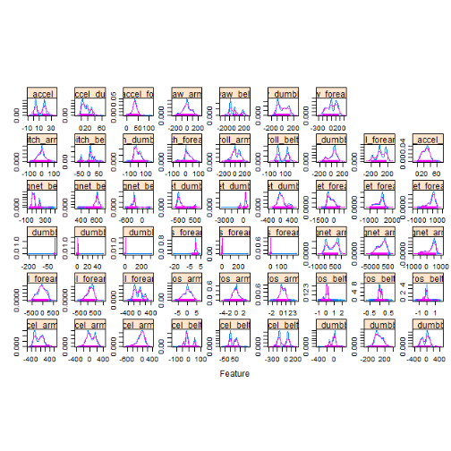
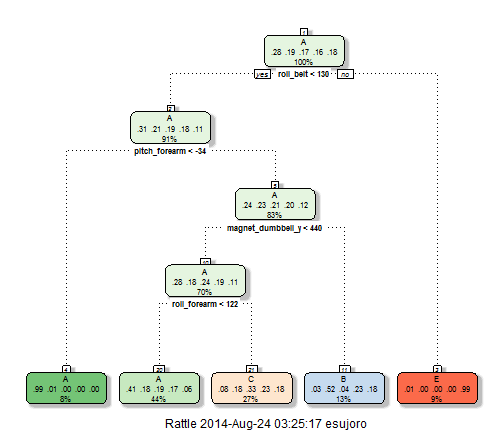
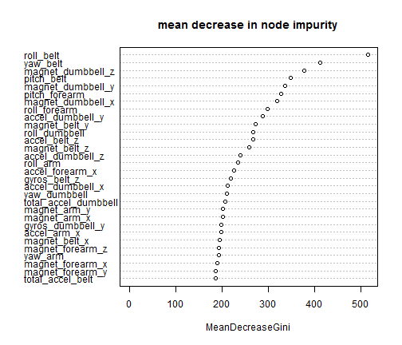
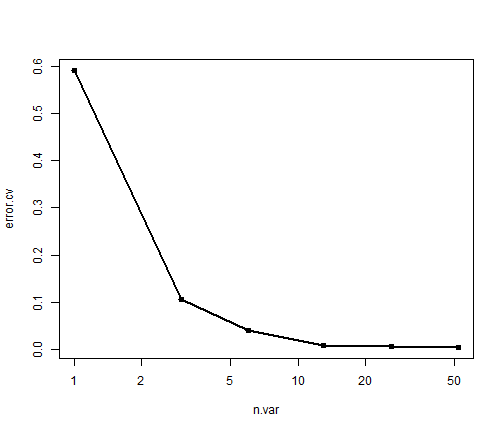

Practical Machine Learning Project Write up
--------------------------------------------------

We first consider the dataset and see what are the variables which are being used in the model. We note that many of the elements being used are actually descriptive statistics of the observations done for every window of the data. Also these descriptive statistics ( like average, max, min, amplitude, skewness, kurtosis, standard deviation, variance) are present for only a few of the rows - i.e. rows which are having new_window=yes. We omit all those columns which are these statistical observations for our predictions. 


```r
# set up environment
options(warn=-1)
library(lattice)
library(caret)
library(rattle)
library(randomForest)
library(cvTools)
library(png)
library(grid)
library(rpart.plot)
library(RColorBrewer)
library(rpart)
# remove statistics columns
pml.training <- read.csv("C:/SujoyRc/Temp/Coursera/pml-training.csv")
pml.testing <- read.csv("C:/SujoyRc/Temp/Coursera/pml-testing.csv")
```

For simplicity of coding we create a new dataset removing these columns.We can also confirm that none of the other columns will have any NAs (and thus no rows will be excluded from our analysis)


```r
cols_exclude_pattern<-c("max","min","skewness","kurtosis","avg","var","stddev","amplitude")
pml_use<-pml.training[ , -grep(paste(cols_exclude_pattern,collapse="|"),names(pml.training))]
apply(pml_use, 2, function(x) length(which(is.na(x))))
```

```
##            user_name raw_timestamp_part_1 raw_timestamp_part_2 
##                    0                    0                    0 
##       cvtd_timestamp           new_window           num_window 
##                    0                    0                    0 
##            roll_belt           pitch_belt             yaw_belt 
##                    0                    0                    0 
##     total_accel_belt         gyros_belt_x         gyros_belt_y 
##                    0                    0                    0 
##         gyros_belt_z         accel_belt_x         accel_belt_y 
##                    0                    0                    0 
##         accel_belt_z        magnet_belt_x        magnet_belt_y 
##                    0                    0                    0 
##        magnet_belt_z             roll_arm            pitch_arm 
##                    0                    0                    0 
##              yaw_arm      total_accel_arm          gyros_arm_x 
##                    0                    0                    0 
##          gyros_arm_y          gyros_arm_z          accel_arm_x 
##                    0                    0                    0 
##          accel_arm_y          accel_arm_z         magnet_arm_x 
##                    0                    0                    0 
##         magnet_arm_y         magnet_arm_z        roll_dumbbell 
##                    0                    0                    0 
##       pitch_dumbbell         yaw_dumbbell total_accel_dumbbell 
##                    0                    0                    0 
##     gyros_dumbbell_x     gyros_dumbbell_y     gyros_dumbbell_z 
##                    0                    0                    0 
##     accel_dumbbell_x     accel_dumbbell_y     accel_dumbbell_z 
##                    0                    0                    0 
##    magnet_dumbbell_x    magnet_dumbbell_y    magnet_dumbbell_z 
##                    0                    0                    0 
##         roll_forearm        pitch_forearm          yaw_forearm 
##                    0                    0                    0 
##  total_accel_forearm      gyros_forearm_x      gyros_forearm_y 
##                    0                    0                    0 
##      gyros_forearm_z      accel_forearm_x      accel_forearm_y 
##                    0                    0                    0 
##      accel_forearm_z     magnet_forearm_x     magnet_forearm_y 
##                    0                    0                    0 
##     magnet_forearm_z               classe 
##                    0                    0
```

```r
summary(pml_use$new_window)
```

```
##    no   yes 
## 19216   406
```

One question is how distribution of the columns differ for  new_window=yes as against new_window=no values - this is to be confident that there is nothing specific about these rows in that they will need to be excluded from the analysis or some special treatment is required. We plot a few of these  and see that there is not much difference between them visually. 


```r
transparentTheme (trans = .9)
featurePlot(x = pml_use[, 8:59],
            y = pml_use$new_window,
            plot = "density",
            ## Pass in options to xyplot() to 
            ## make it prettier
            scales = list(x = list(relation="free"),
                          y = list(relation="free")),
            adjust = 1.5,
            pch = "|",
            layout = c(9, 6),
            auto.key = list(columns = 52))
```

 

To start our modelling, we must split the data into testing and training sets - strictly speaking the testing dataset is an out-of-sample set as it does not have the response variable in it.


```r
set.seed(12345)
inTrain<-createDataPartition(y=pml_use$classe,p=0.7,list=FALSE)
training<-pml_use[inTrain,]
testing<-pml_use[-inTrain,]
### List all columns into one single variable
fmla<-as.formula(paste("classe ~",paste(names(pml_use[8:59]),collapse=" + ")))
```

We start with a RPART model and see the performance. 

```r
modFit<-train(fmla, method="rpart",data=training)
```


```r
fancyRpartPlot(modFit$finalModel)
```

 

And see the model fit statistics both for in-sample and out of sample errors.

**IN-SAMPLE ERRORS**

```r
confusionMatrix(training$classe,predict(modFit))
```

```
## Confusion Matrix and Statistics
## 
##           Reference
## Prediction    A    B    C    D    E
##          A 3564   51  280    0   11
##          B 1090  918  650    0    0
##          C 1115   70 1211    0    0
##          D 1004  402  846    0    0
##          E  357  325  665    0 1178
## 
## Overall Statistics
##                                         
##                Accuracy : 0.5           
##                  95% CI : (0.492, 0.509)
##     No Information Rate : 0.519         
##     P-Value [Acc > NIR] : 1             
##                                         
##                   Kappa : 0.347         
##  Mcnemar's Test P-Value : NA            
## 
## Statistics by Class:
## 
##                      Class: A Class: B Class: C Class: D Class: E
## Sensitivity             0.500   0.5198   0.3316       NA   0.9907
## Specificity             0.948   0.8546   0.8825    0.836   0.8927
## Pos Pred Value          0.912   0.3454   0.5054       NA   0.4665
## Neg Pred Value          0.637   0.9235   0.7848       NA   0.9990
## Prevalence              0.519   0.1286   0.2659    0.000   0.0866
## Detection Rate          0.259   0.0668   0.0882    0.000   0.0858
## Detection Prevalence    0.284   0.1935   0.1744    0.164   0.1838
## Balanced Accuracy       0.724   0.6872   0.6070       NA   0.9417
```

**OUT OF SAMPLE ERRORS**

```r
confusionMatrix(testing$classe,predict(modFit,newdata=testing))
```

```
## Confusion Matrix and Statistics
## 
##           Reference
## Prediction    A    B    C    D    E
##          A 1528   21  123    0    2
##          B  473  389  277    0    0
##          C  480   31  515    0    0
##          D  415  151  398    0    0
##          E  148  161  292    0  481
## 
## Overall Statistics
##                                         
##                Accuracy : 0.495         
##                  95% CI : (0.482, 0.508)
##     No Information Rate : 0.517         
##     P-Value [Acc > NIR] : 1             
##                                         
##                   Kappa : 0.34          
##  Mcnemar's Test P-Value : NA            
## 
## Statistics by Class:
## 
##                      Class: A Class: B Class: C Class: D Class: E
## Sensitivity             0.502   0.5166   0.3209       NA   0.9959
## Specificity             0.949   0.8539   0.8806    0.836   0.8887
## Pos Pred Value          0.913   0.3415   0.5019       NA   0.4445
## Neg Pred Value          0.640   0.9233   0.7757       NA   0.9996
## Prevalence              0.517   0.1280   0.2727    0.000   0.0821
## Detection Rate          0.260   0.0661   0.0875    0.000   0.0817
## Detection Prevalence    0.284   0.1935   0.1743    0.164   0.1839
## Balanced Accuracy       0.725   0.6852   0.6007       NA   0.9423
```

These two results show a match of only 60% approximately - clearly it is not good enough. We attempt a Random Forest result for the same and note the variable importance in a plot.

For simplicity we assign the randomForest object in the train model into a separate model. This will be useful as we will be using randomForest package functions for variable importance plots and cross-validation.


```r
modFit_rf<-train(fmla, method="rf",data=training)
rf<-modFit_rf$finalModel
```


And visualize the node importance in the following plot


```r
varImpPlot(rf,type=2,main="mean decrease in node impurity")
```

 

And the confusion matrices are analyzed

**IN-SAMPLE ERRORS**

```r
confusionMatrix(training$classe,predict(modFit_rf))
```

```
## Confusion Matrix and Statistics
## 
##           Reference
## Prediction    A    B    C    D    E
##          A 3906    0    0    0    0
##          B    0 2658    0    0    0
##          C    0    0 2396    0    0
##          D    0    0    0 2252    0
##          E    0    0    0    0 2525
## 
## Overall Statistics
##                                 
##                Accuracy : 1     
##                  95% CI : (1, 1)
##     No Information Rate : 0.284 
##     P-Value [Acc > NIR] : <2e-16
##                                 
##                   Kappa : 1     
##  Mcnemar's Test P-Value : NA    
## 
## Statistics by Class:
## 
##                      Class: A Class: B Class: C Class: D Class: E
## Sensitivity             1.000    1.000    1.000    1.000    1.000
## Specificity             1.000    1.000    1.000    1.000    1.000
## Pos Pred Value          1.000    1.000    1.000    1.000    1.000
## Neg Pred Value          1.000    1.000    1.000    1.000    1.000
## Prevalence              0.284    0.193    0.174    0.164    0.184
## Detection Rate          0.284    0.193    0.174    0.164    0.184
## Detection Prevalence    0.284    0.193    0.174    0.164    0.184
## Balanced Accuracy       1.000    1.000    1.000    1.000    1.000
```

The confusion matrix for the training dataset gives a result of 100% which creates some concerns if this data is overfitted.

**OUT OF SAMPLE ERRORS**

```r
confusionMatrix(testing$classe,predict(modFit_rf,newdata=testing))
```

```
## Confusion Matrix and Statistics
## 
##           Reference
## Prediction    A    B    C    D    E
##          A 1674    0    0    0    0
##          B    2 1137    0    0    0
##          C    0    5 1021    0    0
##          D    0    0   10  954    0
##          E    0    0    0    0 1082
## 
## Overall Statistics
##                                         
##                Accuracy : 0.997         
##                  95% CI : (0.995, 0.998)
##     No Information Rate : 0.285         
##     P-Value [Acc > NIR] : <2e-16        
##                                         
##                   Kappa : 0.996         
##  Mcnemar's Test P-Value : NA            
## 
## Statistics by Class:
## 
##                      Class: A Class: B Class: C Class: D Class: E
## Sensitivity             0.999    0.996    0.990    1.000    1.000
## Specificity             1.000    1.000    0.999    0.998    1.000
## Pos Pred Value          1.000    0.998    0.995    0.990    1.000
## Neg Pred Value          1.000    0.999    0.998    1.000    1.000
## Prevalence              0.285    0.194    0.175    0.162    0.184
## Detection Rate          0.284    0.193    0.173    0.162    0.184
## Detection Prevalence    0.284    0.194    0.174    0.164    0.184
## Balanced Accuracy       0.999    0.998    0.995    0.999    1.000
```

However the confusion matrix for the testing dataset belies those fears and it is sufficient.

We then run a cross-validation and observer the out-of-sample errors for trees involving 1,3,6,13,26,52 variables.


```r
cv_results<-rfcv(pml_use[,8:59],pml_use[,60])
cv_results$error.cv
```


```
##       52       26       13        6        3        1 
## 0.003618 0.004994 0.007135 0.038732 0.105035 0.592906
```


```r
with(cv_results, plot(n.var, error.cv, log="x", type="o", lwd=2))
```

 

The errrors are very small and provide a good estimae of out-of-sample errors.

These results, all encouraging, allow us to choose the random forest as a model of choice for this problem.
